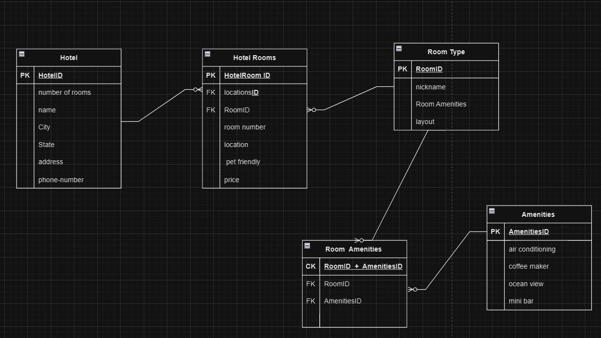
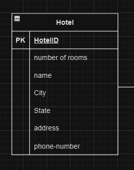
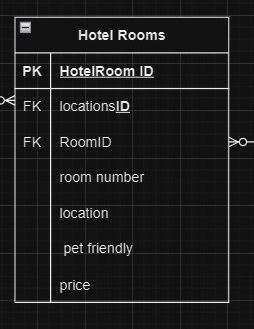
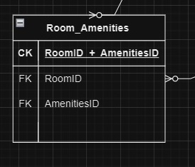

# Async-Inn

# Description

This ERD will be used during Async Inn project. The Hotel table allows us to create a properties for the hotel branch. The Hotel id is passed to the Rooms table , where the Rooms  get another id from room and used to create a unique room. The unique room is have amenities like air conditioning”, “coffee maker”, “ocean view”, “mini bar”.

# ERD:

# Explanation :
Table 1:
Hotel Table : have primary key (hotel ID), and the name, city, state, address, and phone number as attributes . Relationship is (one-to-many) with the join table HotleRoom because every hotel have many room but the room have one hotel.

Table 2:
HotelRoom Table : have primary key (HotelRoomID) , room number, location,  pet friendly, price, as attributes , HotleID , RoomID as foreign keys, where any room can prat of hotel, relationship is (many to one) with hotelbID table  and (many to one) with RoomID table.

Table 3:
Room Table  : have primary key (Room ID) , nickname, layout, Room Amenities, as attributes, have relationship is (one to many) with HotelRoom table and (one to many) with Room Amenities table. 

